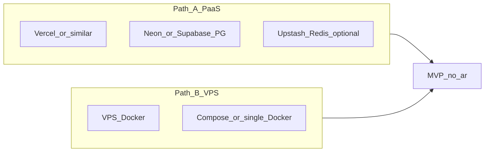

# Plano: Menve Sales no ar (MVP)

## 1. Revisão do estado atual (honesta)

### O que está sólido

- **Stack coerente**: Next.js 16 App Router, Prisma + PostgreSQL, NextAuth v5 (credentials + JWT), UI com padrão shadcn/Tailwind.
- **Multi-tenant**: `[src/middleware.ts](src/middleware.ts)` injeta `x-tenant-slug` via subdomínio (`[src/lib/tenant-edge.ts](src/lib/tenant-edge.ts)`) ou fallback `DEFAULT_TENANT_SLUG`; rotas públicas para login, auth e webhooks.
- **Domínio de negócio**: schema em `[prisma/schema.prisma](prisma/schema.prisma)` cobre CRM (contatos, pipeline, deals, tags, atividades) e WhatsApp (conexões, conversas, mensagens, notas, quick replies).
- **Dev local**: `[docker-compose.yml](docker-compose.yml)` sobe Postgres, Redis e Evolution API; `[.env.example](.env.example)` lista variáveis essenciais.
- **Observabilidade básica**: existe `[src/app/api/health/route.ts](src/app/api/health/route.ts)` (`GET /api/health` com ping no banco).

### Lacunas relevantes para produção

| Área                       | Situação                                                                                                                                                                                                                                                 |
| -------------------------- | -------------------------------------------------------------------------------------------------------------------------------------------------------------------------------------------------------------------------------------------------------- |
| **Migrações**              | Só há `schema.prisma` + seed; **não há pasta `prisma/migrations`**. Hoje o fluxo documentado é `db push` (adequado a dev, frágil para produção versionada).                                                                                              |
| **Container da aplicação** | **Não há Dockerfile** para o Next.js; o compose não sobe o app nem worker.                                                                                                                                                                               |
| **Filas / Redis no app**   | `package.json` declara `bullmq`, `ioredis` e script `"worker": "tsx workers/queue.ts"`, mas **não existe `workers/` no projeto** e **não há imports de BullMQ/Redis em `src/`**. Redis no compose serve sobretudo ao **Evolution API**, não ao app Next. |
| **Testes / CI**            | Scripts `test` / `test:e2e` existem, mas **não há arquivos de teste nem configs** (`vitest.config`, `playwright.config`) nem `.github/workflows`. Qualidade depende de `lint` + `build` manuais.                                                         |
| **Repositório**            | Workspace **não é git** (conforme metadados); sem histórico, branches ou pipeline.                                                                                                                                                                       |
| **Segurança HTTP**         | `[next.config.ts](next.config.ts)` é mínimo; não há headers (HSTS, CSP, etc.) — comum delegar ao provedor, mas vale revisar.                                                                                                                             |
| **Auth em produção**       | `[src/auth.ts](src/auth.ts)` usa `trustHost: true`; em produção exige `**NEXTAUTH_URL` / `AUTH_URL` corretos em HTTPS** e host confiável atrás do proxy.                                                                                                 |

### Conclusão da revisão

O produto está **próximo de um MVP funcional em código**, mas o **empacotamento, versionamento de schema, automação e partes “Fase 5” do README** ainda não estão alinhados com a realidade do repo. Para “estar no ar” de forma sustentável, o esforço concentra-se em **deploy, segredos, DNS, migrações e validação manual/automatizada mínima**, não em reescrever o CRM.

---

## 2. Definição de MVP “no ar”

Sugestão objetiva para o primeiro go-live:

- **Incluído**: login multi-tenant, CRM (contatos, pipeline, deals, atividades), analytics/admin conforme já implementado, **settings** e **inbox** na UI (mesmo que integração WhatsApp ainda esteja em modo “configurado / testado pontualmente”).
- **WhatsApp**: tratar como **camada crítica mas dependente de ambiente** — webhooks precisam de **URL pública HTTPS** e credenciais Evolution ou Meta válidas; pode ser **segunda entrega** se o prazo for apertado, desde que o restante do MVP já esteja estável.
- **Fora do MVP inicial** (pode ficar em backlog): worker BullMQ real, RLS no Postgres, testes E2E amplos, backup automatizado sofisticado (pode começar com backup manual do provedor de DB).

---

## 3. Decisão de hospedagem (dois caminhos válidos)

Escolher **um** caminho define comandos e arquivos (Docker vs build nativo PaaS).

- **Path A — PaaS (ex.: Vercel + Neon + opcional Upstash)**: menor ops, build `prisma generate && next build`, variáveis no painel, Postgres gerenciado. Evolution/Meta apontam para a URL pública do app.
- **Path B — VPS (Docker Compose na VPS)**: um `Dockerfile` para Next + `docker-compose` com Postgres/Redis/Evolution na mesma máquina ou DB gerenciado externo; mais controle, mais manutenção (SSL, updates, firewall).

O plano técnico abaixo é **agnóstico** até a escolha; as tarefas marcam onde o path diverge.

---

## 4. Fases até produção (ordem recomendada)

### Fase A — Baseline do repositório e scripts

- Inicializar **Git** e `.gitignore` adequado (se ainda não existir); definir branch default e política mínima de PR.
- **Corrigir inconsistências**: ou remover/ajustar o script `worker` e dependências não usadas, ou implementar um stub mínimo — hoje `**npm run worker` quebra** por path inexistente.
- Documentar no README o que é **obrigatório** vs **opcional** (Redis para o app vs Evolution).

### Fase B — Versionamento do banco (produção)

- Gerar **primeira migração nomeada** a partir do schema atual: `prisma migrate dev` (ou fluxo equivalente) e commit de `prisma/migrations/`.
- Em deploy: usar `**prisma migrate deploy`** (não `db push`) no pipeline ou entrypoint.
- Validar seed apenas em **staging** ou primeiro deploy controlado (evitar sobrescrever dados reais).

### Fase C — Ambiente e segredos

- Listar todas as variáveis de `[.env.example](.env.example)` e mapear para o provedor (secrets manager / env criptografado).
- Definir `**NEXTAUTH_URL`**, `**NEXTAUTH_SECRET`** forte, `**DATABASE_URL**` de produção, `**NEXT_PUBLIC_APP_URL**`, `**DEFAULT_TENANT_SLUG**` coerente com o primeiro tenant.
- Para WhatsApp: `EVOLUTION_API_KEY`, `EVOLUTION_WEBHOOK_SECRET`, `META_*` conforme o provider escolhido.

### Fase D — Build e deploy

- **Path A**: configurar projeto no PaaS (build command já alinhado com `[package.json](package.json)`: `prisma generate && next build`); variáveis; região próxima ao DB.
- **Path B**: adicionar **Dockerfile** multi-stage para Next + documentar `docker compose` de produção (app + reverse proxy Traefik/Caddy/Nginx com TLS).
- Garantir que `**/api/health`** responda atrás do domínio final (usado por monitoramento).

### Fase E — DNS, TLS e multi-tenant

- Apontar domínio raiz e, se usar subdomínios por tenant, **wildcard DNS** (`*.dominio.com`) e certificado (Let’s Encrypt via proxy ou provedor).
- Testar login e resolução de tenant com o **Host** real (não só `localhost`).

### Fase F — WhatsApp (go-live da integração)

- Evolution: `SERVER_URL` público, API key alinhada ao app, webhook apontando para `POST /api/webhooks/whatsapp/evolution/[connectionId]`.
- Meta: configurar app, verify token, assinatura de webhook em `GET/POST /api/webhooks/whatsapp/meta`.
- Teste ponta a ponta: mensagem recebida → aparece no inbox → resposta (se envio estiver implementado no provider).

### Fase G — Qualidade mínima e operação

- **CI** (GitHub Actions ou similar): pelo menos `npm ci`, `npm run lint`, `npm run build` em PR.
- **Testes**: smoke manual checklist (login, CRUD contato, mover deal, inbox); opcionalmente 1–2 testes E2E críticos (Playwright) depois de estabilizar URLs.
- **Monitoramento**: uptime no `/api/health`; logs no provedor; alertas básicos.

### Fase H — Pós-MVP (não bloqueante)

- Backups automáticos do Postgres (provedor ou cron `pg_dump`).
- Hardening: rate limit em webhooks, revisão CSP/HSTS, rotação de secrets.

---

## 5. Riscos e mitigação

| Risco                               | Mitigação                                                                    |
| ----------------------------------- | ---------------------------------------------------------------------------- |
| `db push` em produção sem histórico | Migrar para `migrate deploy` + migrations versionadas (Fase B).              |
| Webhooks WhatsApp inacessíveis      | URL HTTPS pública, firewall liberado, paths exatos documentados no README.   |
| Subdomínio não resolve              | DNS wildcard + teste com `curl -H "Host: tenant.dominio.com"`.               |
| Script `worker` quebrando CI/deploy | Remover ou implementar antes de qualquer pipeline que rode todos os scripts. |

---

## 6. Entregáveis sugeridos ao final do MVP

- App acessível em HTTPS com login e CRM utilizável.
- Banco com migrações aplicadas e backup ou export inicial documentado.
- Variáveis documentadas e rotacionáveis.
- CI com lint + build; healthcheck validado.
- README atualizado com **runbook de deploy** (Path A ou B escolhido) e checklist WhatsApp.

