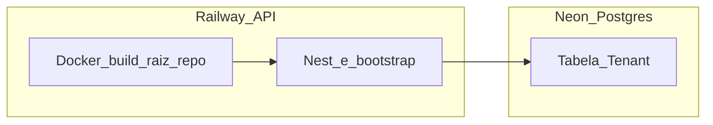
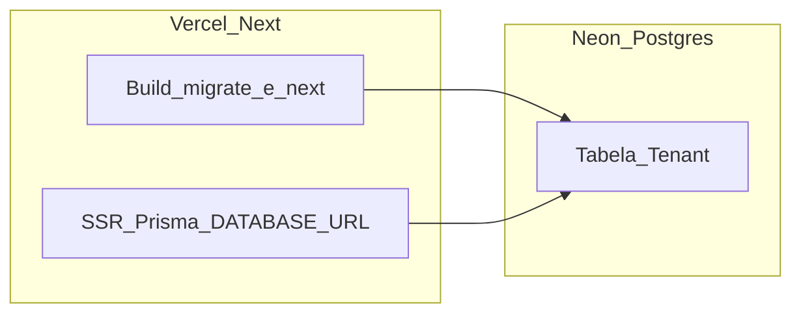

# Passo a passo “botão a botão” — `vendas.menvedigital.com.br` + API + Neon

Use este guia **depois** de ter o código no GitHub (ou GitLab/Bitbucket) na branch que a Vercel/Railway vão usar.

**Valores que você vai inventar uma vez e reutilizar:**

- `INTERNAL_API_KEY` e `JWT_SECRET`: strings longas e aleatórias (ex.: `openssl rand -base64 32` no terminal).
- Subdomínio da API: neste guia usamos **`api.vendas.menvedigital.com.br`** (ajuste se preferir outro nome).

---

## Parte A — Neon (Postgres)

1. Abra [https://console.neon.tech](https://console.neon.tech) e faça login (GitHub/Google).
2. Clique em **Create a project** (ou **New project**).
3. Preencha **Project name** (ex.: `menve-sales-prod`), escolha região próxima (ex.: **South America** se existir, senão **US East**).
4. Clique em **Create project**.
5. Na tela do projeto, abra **Dashboard** (ou fique na visão inicial do branch `main` / `production`).
6. Em **Connection details** (ou **Connect**):
   - Selecione o **role** padrão e o **database** `neondb` (ou o que a Neon criou).
   - Em **Connection string**, escolha o modo **Pooled** (ou string que mostra host com **`-pooler`** no nome).
   - Copie a URL. Guarde como **`DATABASE_URL` (pooler)**. Confirme que tem `sslmode=require` (ou equivalente) se a Neon indicar.
7. Troque para a string **Direct** (ou **Non-pooling** / host **sem** `-pooler`). Copie. Guarde como **`DIRECT_URL`**.
8. (Opcional) Clique em **Reset password** só se precisar; se resetar, gere de novo as duas URLs acima.

**Checklist:** você tem dois blocos de texto começando com `postgresql://...`, um com pooler e outro sem.

---

## Parte B — API Nest na Railway (clique a clique)

> Alternativa: Render — veja a **Parte B2** no final deste arquivo.

1. Abra [https://railway.app](https://railway.app) e faça login.
2. **New project** → **Deploy from GitHub repo** (autorize a Railway se pedir).
3. Selecione o repositório **menve-sales** (ou o nome do seu repo).
4. A Railway cria um serviço; abra o card do serviço → **Settings**:
   - **Root Directory:** deixe **vazio** (raiz do repositório), **não** use `menve-sales-api` — o [`Dockerfile`](../menve-sales-api/Dockerfile) espera o monorepo inteiro.
   - **Dockerfile path:** `menve-sales-api/Dockerfile`
   - **Builder:** Docker.
5. Aba **Variables** (ou **Variables** dentro do serviço) → **+ New Variable** e adicione **uma por uma** (Production):

   | Nome | Valor |
   |------|--------|
   | `DATABASE_URL` | Colar a URL **pooler** da Neon |
   | `DIRECT_URL` | Colar a URL **direta** da Neon |
   | `JWT_SECRET` | Sua string forte (ex. base64 32 bytes) |
   | `INTERNAL_API_KEY` | Mesmo valor que você vai colar na Vercel |
   | `PUBLIC_APP_URL` | `https://api.vendas.menvedigital.com.br` (ajuste ao domínio real da API) |
   | `CORS_ORIGIN` | `https://vendas.menvedigital.com.br` |
   | `NODE_ENV` | `production` |

   *(Evolution/Meta: só depois, conforme [`menve-sales-api/docs/WHATSAPP-GOLIVE.md`](../menve-sales-api/docs/WHATSAPP-GOLIVE.md).)*

6. **Settings** → **Networking** → **Generate domain** (a Railway mostra algo como `xxx.up.railway.app`). Clique para gerar se ainda não existir.
7. **Deployments:** espere o deploy ficar **Success** (verde). Se falhar, abra os **Logs** e corrija env faltando.

### Se o build falhar em `npm ci` (Railpack / monorepo na raiz)

O `package-lock.json` da API usa **lockfile version 3**, que exige **npm 7+** (Node 16+). Se a Railway usar Node/npm velhos, o `npm ci` quebra e o log parece “ajuda” do npm (`Usage: npm ci`).

**Opção 1 — variável (rápido):** no serviço, aba **Variables** → adicione:

| Nome | Valor |
|------|--------|
| `NIXPACKS_NODE_VERSION` | `20` |

Mantenha o **Build Command:** `cd menve-sales-api && npm ci && npm run build` e o **Start Command:** `cd menve-sales-api && npm run start`. **Redeploy**.

**Opção 2 — Docker (recomendado):** em **Settings → Build**, **Builder** = **Dockerfile**, **Dockerfile path** = `menve-sales-api/Dockerfile`, **Root Directory** = vazio (raiz do repo). **Apague** Custom Build e Custom Start. **Redeploy**. O monorepo tem **dois** `package-lock.json` (raiz e `menve-sales-api/`); o Dockerfile roda `npm ci` nos dois — só o da raiz não instala o Nest (`nest` / `@nestjs/cli`).

**Opção 3 — sem `ci` (só se ainda falhar):** Build Command temporário: `cd menve-sales-api && npm install && npm run build` (menos reproduzível que `npm ci`, use só para destravar).
8. **Domínio customizado da API:** **Settings** → **Networking** → **Custom Domain** → digite `api.vendas.menvedigital.com.br` → **Add**. A Railway mostra um **CNAME** alvo (ex.: `xxxx.railway.app` ou similar). **Anote** esse alvo — você vai colar no DNS na Parte D.

9. O healthcheck da Railway usa `GET /health/live` (sempre 200 se o processo subiu). O bind HTTP **não espera** mais o Postgres nem o bootstrap de tenants — Neon pode “acordar” depois. Para validar o banco: `GET /health` → `"db":"up"`. Segredos fracos geram **log** (não derrubam o processo), salvo `ENFORCE_PRODUCTION_SECRETS=1` no serviço.

### Detalhe adicional — Railway após ajuste do monorepo

O [`Dockerfile`](../menve-sales-api/Dockerfile) foi feito para o **contexto de build = raiz do repositório Git** (onde estão o `package.json` principal e a pasta `menve-sales-api/`). O [`railway.toml`](../railway.toml) na **raiz do repo** declara `dockerfilePath = "menve-sales-api/Dockerfile"` (sem esse arquivo na raiz, a Railway tende a usar Nixpacks e pode falhar no `apt`). Ao subir o processo, o Nest executa o [`AppBootstrapService`](../menve-sales-api/src/prisma/app-bootstrap.service.ts), que garante tenants (`demo`, `vendas`, `crm`, `menve-digital`) e usuários bootstrap no **mesmo** Postgres do `DATABASE_URL` configurado na Railway.



**Onde clicar (passo a passo)**

1. Em [railway.app](https://railway.app), abra o **projeto** → o **serviço** que roda a API (não confunda com um serviço Postgres separado, se existir).
2. **Settings** → **Source** (ou seção equivalente de repositório): **Root Directory** = **vazio** (repo inteiro). **Não** use `menve-sales-api` como root — o Docker precisa ver `menve-sales-api/` como **subpasta** e o `package-lock.json` da raiz.
3. **Settings** → **Build**: **Builder** = **Dockerfile**. **Dockerfile path** = `menve-sales-api/Dockerfile` (caminho relativo à raiz do Git). Apague **Custom Build Command** e **Custom Start Command**, se existirem (a imagem já executa `node dist/main.js` em `/app`). Comandos do tipo `cd menve-sales-api && npm start` **quebram** o deploy Docker (`The executable "cd" could not be found`) — `cd` não é executável, é builtin do shell. O [`railway.toml`](../railway.toml) na raiz define `startCommand = "node dist/main.js"` para alinhar o painel ao código.
4. **Variables**: confira `DATABASE_URL` (pooler) e `DIRECT_URL` (direto) — mesmas ideias da Parte A — além de `JWT_SECRET`, `INTERNAL_API_KEY`, `CORS_ORIGIN`, `PUBLIC_APP_URL`, `NODE_ENV=production` (tabela do passo 5 acima). Para mais de um front (ex.: `vendas` e `crm`), use **vários** hosts em `CORS_ORIGIN` separados por **vírgula**.
5. **Deployments** → **Redeploy** sempre que mudar Source/Build ou variáveis críticas.
6. **Logs do build**: devem mosthar cópia do monorepo, `npm ci` na raiz, `prisma generate` com schema em `menve-sales-api` e `nest build`.
7. **Logs em runtime** (após o deploy ficar **Running**): procure mensagem de bootstrap (tenants/workspaces verificados). Erros de conexão com o banco aparecem aqui e em `GET /health` como `db: down`.
8. **Testes no navegador ou curl:**
   - `GET https://<sua-api>/health` → JSON com `"ok": true` e `"db": "up"`.
   - `GET https://<sua-api>/tenants/by-slug/crm` → JSON com `"slug":"crm"` (público), após o bootstrap ter rodado.

**Se o build Docker falhar:** quase sempre **Root Directory** ainda aponta para `menve-sales-api` ou o **Dockerfile path** está errado.

---

## Parte C — Next.js na Vercel (clique a clique)

1. Abra [https://vercel.com](https://vercel.com) e faça login.
2. **Add New…** → **Project**.
3. **Import Git Repository** → escolha o mesmo repo → **Import**.
4. **Configure Project:**
   - **Framework Preset:** Next.js (detectado).
   - **Root Directory:** deixe **vazio** ou **`.`** (raiz do monorepo, onde está [`vercel.json`](../vercel.json)). **Não** selecione só `menve-sales-web`.
5. **Environment Variables** → **Add** cada uma (ambiente **Production**):

   | Nome | Valor |
   |------|--------|
   | `DATABASE_URL` | URL **pooler** Neon (igual Railway) |
   | `DIRECT_URL` | URL **direta** Neon |
   | `NEXTAUTH_URL` | `https://vendas.menvedigital.com.br` |
   | `NEXT_PUBLIC_APP_URL` | `https://vendas.menvedigital.com.br` |
   | `AUTH_SECRET` ou `NEXTAUTH_SECRET` | String forte (≥ 32 caracteres; diferente do JWT da API) |
   | `INTERNAL_API_URL` | `https://api.vendas.menvedigital.com.br` **sem barra no final** |
   | `INTERNAL_API_KEY` | **Exatamente** o mesmo da Railway |

6. Clique em **Deploy** e aguarde o build (inclui `prisma migrate deploy` via `vercel.json`).
7. Quando terminar, **Continue to Dashboard** → **Settings** → **Domains** → **Add** → digite `vendas.menvedigital.com.br` → **Add**.
8. A Vercel mostra o que configurar no DNS (geralmente **CNAME** `vendas` → algo como `cname.vercel-dns.com` ou registro de verificação). **Anote** o valor exato da Vercel para a Parte D.

### Detalhe adicional — Vercel (`DATABASE_URL` no runtime e domínio CRM)

O [`vercel.json`](../vercel.json) roda `prisma migrate deploy` no **build** usando `DATABASE_URL` e `DIRECT_URL`. O Next também resolve o tenant **lendo o Postgres no runtime** (Server Components), via [`menve-sales-web/src/lib/tenant.ts`](../menve-sales-web/src/lib/tenant.ts) e [`tenant-db.ts`](../menve-sales-web/src/lib/tenant-db.ts), **desde que** `DATABASE_URL` esteja definido no ambiente **Production** da Vercel. Sem isso, o app depende só de `GET` na API (`INTERNAL_API_URL`) para descobrir o tenant — qualquer falha de rede ou URL errada da API leva a `/setup`.



**Onde clicar (passo a passo)**

1. [vercel.com](https://vercel.com) → seu projeto → **Settings** → **Environment Variables**.
2. Para cada variável abaixo, use **Add New** (ou edite a existente), marque **Production** (e **Preview** só se quiser o mesmo comportamento em previews):
   - **`DATABASE_URL`**: string **pooled** da Neon (host costuma ter `-pooler`) — **o mesmo projeto Neon** que a Railway usa.
   - **`DIRECT_URL`**: string **direta** (sem pooler), para o `migrate deploy` no build não travar (ex.: P1002).
3. **Redeploy obrigatório** após criar ou alterar `DATABASE_URL` / `DIRECT_URL`: aba **Deployments** → menu **⋯** no último deploy de **Production** → **Redeploy**. Deploys antigos não aplicam env novo no runtime das funções server-side sozinhos.
4. **Domínio `crm.menvedigital.com.br` (exemplo):** além das variáveis da tabela do passo 5 da Parte C, ajuste:
   - `NEXTAUTH_URL` = `https://crm.menvedigital.com.br`
   - `NEXT_PUBLIC_APP_URL` = `https://crm.menvedigital.com.br`
   - `INTERNAL_API_URL` = URL HTTPS pública da API **sem barra no final**
   - `INTERNAL_API_KEY` = **idêntico** ao da Railway
5. Na **API** (Railway), em `CORS_ORIGIN`, inclua `https://crm.menvedigital.com.br` se houver chamadas do **browser** à API (além das chamadas server-to-server da Vercel). Vários hosts: separados por **vírgula** — veja [`menve-sales-api/.env.example`](../menve-sales-api/.env.example).
6. **Se `/setup` ainda aparecer** com slug `crm`: ou não existe linha `Tenant` com esse slug no Neon que a Vercel usa, ou o `DATABASE_URL` da Vercel **não é o mesmo** banco da API, ou falta **redeploy** depois de mudar as variáveis.

**Ordem recomendada após mudanças estruturais:** (1) Railway com Root + Docker corretos → redeploy → `/health` OK; (2) Vercel com envs + redeploy; (3) testar o domínio do CRM.

Visão técnica resumida: [`DEPLOY-VENDAS-VERCEL-API.md`](./DEPLOY-VENDAS-VERCEL-API.md).

---

## Parte D — DNS no Registro.br (ou seu provedor)

1. Acesse o painel do domínio **menvedigital.com.br** → área de **DNS** / **Endereçamento** / **Zona DNS**.
2. **Subdomínio `vendas` (site na Vercel):**
   - Crie registro tipo **CNAME**.
   - **Nome / Host:** `vendas` (alguns painéis pedem `vendas.menvedigital.com.br` completo — siga o que o provedor pedir).
   - **Destino / Aponta para:** o host que a **Vercel** mostrou no passo C.8 (ex.: `cname.vercel-dns.com`).
   - Salve.
3. **Subdomínio `api.vendas` (API na Railway):**
   - Crie outro **CNAME**.
   - **Nome / Host:** `api.vendas` (ou equivalente para formar `api.vendas.menvedigital.com.br`).
   - **Destino:** o alvo que a **Railway** mostrou em Custom Domain (Parte B.8).
   - Salve.
4. Aguarde propagação (15 min a algumas horas). Na Vercel, o domínio deve mudar para **Valid**; na Railway, **Verified**.

---

## Parte E — Seed do banco (tenant `vendas` + usuário)

Rode **no seu PC**, com o repositório clonado e Node/npm instalados.

1. Abra um terminal na pasta do monorepo.
2. Defina a URL de produção **só para este comando** (PowerShell):

   ```powershell
   $env:DATABASE_URL = "COLE_AQUI_A_URL_POOLER_NEON"
   cd menve-sales-api
   npx prisma db seed
   ```

3. Deve aparecer mensagem de sucesso do seed, citando `owner@vendas.menvedigital.local` (senha padrão do seed: `admin123` — **altere no primeiro login em produção**).

Se der erro de conexão, confira firewall/VPN e se a Neon aceita seu IP (Neon costuma aceitar de qualquer lugar com TLS).

---

## Parte F — Smoke automatizado

Na **raiz** do monorepo:

```bash
npm run smoke:prod -- https://api.vendas.menvedigital.com.br https://vendas.menvedigital.com.br
```

(Ajuste as URLs se seus domínios forem outros.)

Saída esperada: três linhas **OK** (health da API, tenant `vendas`, `/api/health` do Next). Se falhar, leia o erro no terminal e confira envs/DNS.

---

## Parte G — Checklist manual e WhatsApp

1. Abra `https://vendas.menvedigital.com.br/login`.
2. Entre com o usuário do tenant **vendas** (ex.: `owner@vendas.menvedigital.local` / senha do seed até você trocar).
3. Navegue em contatos, pipeline, configurações.
4. WhatsApp (Evolution/Meta): siga **[`menve-sales-api/docs/WHATSAPP-GOLIVE.md`](../menve-sales-api/docs/WHATSAPP-GOLIVE.md)** — em especial URLs públicas HTTPS e **Reaplicar webhook** após o deploy estável.

Lista curta adicional: [`menve-sales-api/docs/SMOKE-CHECKLIST.md`](../menve-sales-api/docs/SMOKE-CHECKLIST.md).

---

## Parte B2 — API no Render (alternativa à Railway)

1. [https://dashboard.render.com](https://dashboard.render.com) → **New** → **Web Service**.
2. Conecte o repo → **Root Directory** `menve-sales-api` (ou use Blueprint com [`menve-sales-api/render.yaml`](../menve-sales-api/render.yaml) na raiz do repo).
3. **Environment:** **Docker**; Dockerfile path `./Dockerfile` se root = `menve-sales-api`.
4. Adicione as **mesmas** variáveis da tabela da Parte B.5.
5. **Create Web Service** → aguarde o deploy.
6. **Settings** → **Custom Domains** → adicione `api.vendas.menvedigital.com.br` → configure o CNAME que o Render indicar no seu DNS (Parte D, mesmo raciocínio da Railway).

---

## Referência rápida

- Visão geral técnica: [`DEPLOY-VENDAS-VERCEL-API.md`](./DEPLOY-VENDAS-VERCEL-API.md)
- Variáveis de exemplo: [`.env.example`](../.env.example) e [`menve-sales-api/.env.example`](../menve-sales-api/.env.example)
