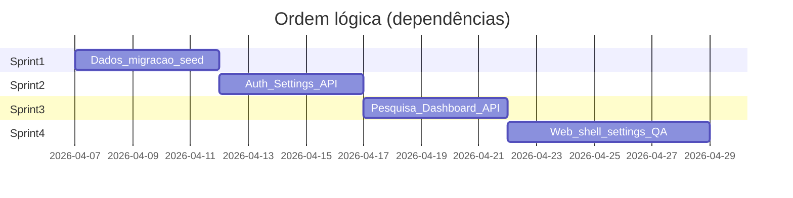

# Gestão em Sprints — Workspace v1 + toggle Pesquisa

**Documento de apoio ao Scrum** derivado do plano técnico em `.cursor/plans/workspace_e_flag_pesquisa_7de9f83f.plan.md` (referência de escopo e squads).

| Campo | Valor |
|--------|--------|
| **Épico** | Workspace (Tenant) como produto + flag `researchEnabled` (Pesquisa) com enforcement API + shell web |
| **Objetivo de negócio** | Workspaces sem prospecção ativa não expõem Pesquisa; configuração centralizada; RBAC na API (fechar gap BFF-only) |
| **Duração sugerida por sprint** | 1 ou 2 semanas (ajustar à velocidade do time) |
| **Premissa** | `Tenant` = Workspace v1; um usuário ↔ um `tenantId`; multi-workspace fora de escopo |

**Papéis Scrum (sugestão)**

- **Product Owner**: prioriza escopo, valida critérios de aceite de negócio (quem pode renomear workspace vs só toggle).
- **Scrum Master** (este documento): facilita dependências entre squads, remove bloqueios, garante DoD e transparência do backlog.
- **Time**: squads-dados, auth, settings, pesquisa, layout, dashboard, membros (opcional), QA.

---

## Definição de 100% concluído (release)

O épico está **fechado** quando todos os itens abaixo forem verdadeiros:

1. **Dados**: migration aplicada; seed com workspace **Menve Digital** + usuário OWNER dev; `.env.example` com `DEFAULT_TENANT_SLUG` documentado.
2. **API**: `GET /tenants/by-slug/:slug` expõe `researchEnabled`; `PATCH /settings/tenant` com RBAC (sem SELLER/MANAGER alterando o que produto definiu); todos os endpoints `/prospecting/*` retornam **403** com flag off.
3. **Web**: sidebar sem link Pesquisa quando off; `/pesquisa` redireciona quando off; switch em Configurações persiste e atualiza navegação após refresh.
4. **Dashboard**: sem erro com flag off; métricas de prospecção zeradas ou omitidas conforme decisão registrada no PR.
5. **QA**: matriz papel × rota executada (evidência no PR ou ferramenta de teste); caso SUPER_ADMIN + `DEFAULT_TENANT_SLUG` validado.

---

## Visão das sprints (macro)

| Sprint | Foco | Principais squads |
|--------|------|-------------------|
| **Sprint 1** | Fundação de dados | squad-dados |
| **Sprint 2** | Contrato público + config workspace + segurança PATCH | squad-auth, squad-settings (API) |
| **Sprint 3** | Enforcement Pesquisa + Dashboard | squad-pesquisa, squad-dashboard |
| **Sprint 4** | Experiência web + QA + hardening + opcional membros | squad-layout, squad-settings (web), QA, squad-membros (opcional) |

> **Nota**: Se o time for pequeno e full-stack, Sprint 2 e 3 podem ser **unificados** em uma única sprint (“API completa”), mantendo a **ordem** interna: dados → settings/auth → prospecting → dashboard.

---

## Refinamento pré–Sprint 1 (backlog ready)

Antes de iniciar Sprint 1, o PO confirma com o time (decisão documentada no primeiro PR):

- [ ] **Política de rename do workspace**: `MANAGER` pode ou não alterar `name` do tenant? (Plano técnico recomenda alinhar rename ao mesmo nível do toggle: OWNER/ADMIN/SUPER_ADMIN.)
- [ ] **Dashboard com flag off**: preferência de UX — **zeros** vs **omitir série** (squad-dashboard + PO).
- [ ] **Slug padrão dev**: `menve-digital` como `DEFAULT_TENANT_SLUG` no monorepo.

**DoR (Definition of Ready) por história**: critérios de aceite claros, dependência identificada, estimativa (pontos ou horas), owner de squad.

---

## Sprint 1 — Fundação de dados

**Meta da sprint**: O banco e o seed refletem `researchEnabled` e o workspace Menve Digital; nenhuma regressão em ambientes existentes.

| ID | História / entrega | Squad | Critérios de aceite (resumo) | Estimativa |
|----|-------------------|-------|------------------------------|------------|
| S1-1 | Como desenvolvedor, quero a coluna `Tenant.researchEnabled` com default `true` para não mudar comportamento atual. | dados | Migration idempotente; `migrate deploy` ok em base vazia e com histórico | M |
| S1-2 | Como time interno, quero seed com workspace **Menve Digital** e usuário OWNER para desenvolvimento padronizado. | dados | `upsert` slug `menve-digital`; OWNER vinculado; decisão sobre `demo` documentada | M |
| S1-3 | Como novo dev, quero `.env.example` indicando `DEFAULT_TENANT_SLUG=menve-digital`. | dados | Arquivos de exemplo atualizados na raiz / api / web conforme existir variável | S |

**DoD Sprint 1**

- [ ] PR revisado (dados + alguém de auth ou backend para checar impacto em tipos).
- [ ] Comentário na migration sobre rollback e política de dados legados (não apagar Prospect*).
- [ ] CI verde (build Prisma / testes existentes).

**Riscos**: conflito com outras migrations em flight → SM coordena ordem de merge com branch principal.

---

## Sprint 2 — API pública do tenant + settings + RBAC

**Meta da sprint**: Contratos REST prontos para o front e para o guard de Pesquisa; gap de segurança do `PATCH /settings/tenant` fechado.

**Dependência**: Sprint 1 mergeada (coluna existe).

| ID | História / entrega | Squad | Critérios de aceite (resumo) | Estimativa |
|----|-------------------|-------|------------------------------|------------|
| S2-1 | Como cliente Next.js, quero `GET /tenants/by-slug/:slug` com `researchEnabled` para montar o shell. | auth | JSON inclui boolean; continua `@Public()`; sem PII extra | S |
| S2-2 | Como segurança, quero que apenas papéis autorizados alterem nome/flag conforme política PO. | auth | `assertCanManageWorkspaceFeatures` (ou split nome vs flag); `SettingsController` chama assert com `@ReqUser()` | M |
| S2-3 | Como integrador, quero `PATCH /settings/tenant` com body parcial e validação de body vazio (400). | settings | `{ name? }` e/ou `{ researchEnabled? }`; serviço atualiza só campos enviados | M |
| S2-4 | Como front, quero `GET /settings` retornando `tenant` com `researchEnabled` no bundle. | settings | Nenhum `select` que remova o campo | S |
| S2-5 | Como dev web, quero helper `assertCanManageWorkspaceFeatures` em `session.ts` alinhado à API. | auth | Mesmos papéis que a API para ações de toggle/rename conforme política | S |

**DoD Sprint 2**

- [ ] Evidência: SELLER (e MANAGER se política unificada) recebe **403** no PATCH inadequado (teste integração ou checklist manual anexado ao PR).
- [ ] Documentação mínima do contrato PATCH no código (DTO/comentário).

**Riscos**: mudança de comportamento para MANAGER ao renomear tenant → comunicar no changelog da sprint (PO).

---

## Sprint 3 — Enforcement Pesquisa + Dashboard

**Meta da sprint**: Com flag desligada, API de prospecção e agregados do dashboard não vazam funcionalidade nem quebram o client.

**Dependência**: Sprint 1 + 2 mergeadas.

| ID | História / entrega | Squad | Critérios de aceite (resumo) | Estimativa |
|----|-------------------|-------|------------------------------|------------|
| S3-1 | Como tenant com Pesquisa desligada, quero que todas as rotas `/prospecting/*` retornem 403. | pesquisa | `ensureResearchEnabled` (ou Guard) em todos os métodos do controller; mensagem estável | M |
| S3-2 | Como tenant com Pesquisa desligada, quero que o dashboard não quebre e reflita ausência de prospecção. | dashboard | `DashboardService.stats` / `prospectingBlock` compatível com front; query service se aplicável | M |
| S3-3 | Como observador, quero chamadas internas (API key) respeitando o mesmo tenant e flag. | pesquisa + auth | Sem bypass indevido para “internal” | S |

**DoD Sprint 3**

- [ ] Lista de endpoints `/prospecting` verificada (checklist no PR).
- [ ] Smoke manual: tenant com `researchEnabled: false` → 403 em pelo menos POST search e GET searches.

**Riscos**: painéis personalizados com widget de Pesquisa → alinhar estratégia zeros vs omitir com squad-dashboard no daily.

---

## Sprint 4 — Web (shell + config) + QA + opcional membros

**Meta da sprint**: Experiência de usuário completa; épico atinge 100% na checklist de release.

**Dependência**: Sprints 1–3 mergeadas.

| ID | História / entrega | Squad | Critérios de aceite (resumo) | Estimativa |
|----|-------------------|-------|------------------------------|------------|
| S4-1 | Como usuário, não quero ver “Pesquisa” na sidebar se o workspace desligou a função. | layout | `layout.tsx` resolve tenant; `Sidebar` filtra `/pesquisa`; tratar SUPER_ADMIN + tenant null | M |
| S4-2 | Como usuário, não quero acessar `/pesquisa` por URL com a função desligada. | layout | `redirect` para dashboard (ou rota acordada) | S |
| S4-3 | Como Owner/Admin, quero ligar/desligar Pesquisa nas configurações do workspace. | settings | Switch + `updateTenantResearchEnabled`; `revalidatePath`; sem switch para quem não pode | M |
| S4-4 | Como usuário na Pesquisa, quero mensagem clara se a API retornar 403. | pesquisa + web | Tratamento em `actions/pesquisa.ts` ou UI | S |
| S4-5 | Como QA, quero matriz papel × rota e cenários de borda executados com evidência. | QA | Tabela do plano técnico preenchida; E2E ou checklist | M |
| S4-6 | (Opcional) Como usuário, quero labels claros Owner/Admin/Gestor/Vendedor na lista de membros. | membros | Apenas copy em `settings-members.tsx` | S |

**DoD Sprint 4**

- [ ] Checklist **100% concluído** (seção no topo deste doc) marcada.
- [ ] Demo na review de sprint (toggle on/off + deep link + dashboard).
- [ ] Retrospectiva: anotar follow-ups (ex.: JWT com flag para evitar fetch extra no layout).

---

## Cerimônias (sugestão SM)

| Cerimônia | Uso neste épico |
|-----------|-----------------|
| **Planning** | Ao início de cada sprint: compromisso com as histórias da tabela; checar dependências entre squads. |
| **Daily** | Foco em integração (API ↔ web) e ordem de merge; desbloquear revisão cruzada auth/settings/pesquisa. |
| **Refinement** | Meio do sprint: preparar próxima sprint (ex.: contratos já estáveis antes de S4). |
| **Review** | Demo end-to-end a partir de S4; S1–S3 podem ser “demo técnica” (Postman + DB). |
| **Retro** | Uma por sprint ou uma ao fechar épico; capturar dívida (ex.: OpenAPI, E2E automatizado). |

---

## Capacidade e rastreabilidade

- Mapear cada **ID (S1-1, S2-1, …)** para issues no board (Jira/Linear/GitHub Projects).
- **Branch strategy**: uma branch de épico `feature/workspace-pesquisa` com PRs menores por sprint, ou PR por sprint — o SM alinha com política de versionamento do repositório ([`.cursor/rules/squad-versionamento.mdc`](../.cursor/rules/squad-versionamento.mdc)).

---

## Aprovações (preencher antes da execução)

| Papel | Nome | Data | Assinatura / OK |
|-------|------|------|------------------|
| Product Owner | | | |
| Tech Lead (auth) | | | |
| Tech Lead (dados) | | | |
| QA | | | |

**Versão do documento**: 1.0 — alinhado ao plano técnico workspace + Pesquisa.
