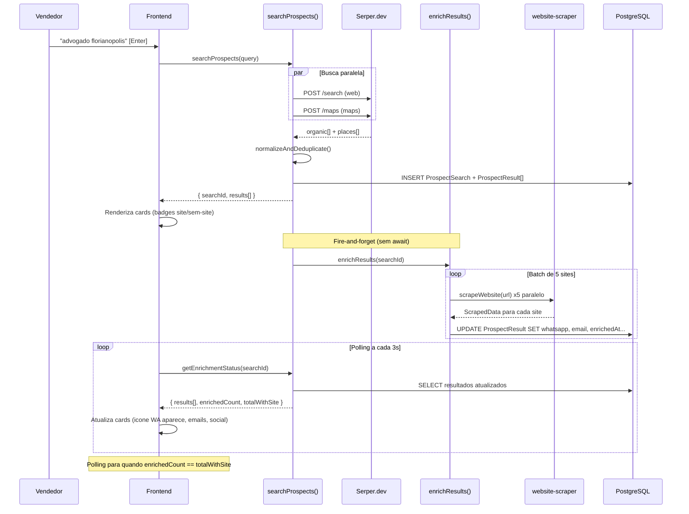

# Ferramenta de Prospeccao Ativa - Uso Interno Menve

## Contexto e Objetivo

A equipe comercial da Menve precisa de uma ferramenta interna para **prospeccao ativa outbound**: encontrar empresas no Google, qualificar rapidamente (tem site? tem WhatsApp?), e alimentar o pipeline oficial de vendas. Hoje isso e feito manualmente com extensoes de Chrome para Google Maps -- queremos ir alem, priorizando a **rede de pesquisa** (empresas com site) e automatizando a extracao de dados de contato.

**Conceito central:** A pagina `/prospecting` e uma **pesquisa inteligente**. Ela nao tem pipeline proprio -- quando o vendedor encontra uma empresa interessante, converte direto para o **pipeline oficial da Menve** (Oportunidade -> Negocio fechado), ja trazendo todas as informacoes e a origem "Prospeccao Ativa".

**Diferencial vs extensoes de Chrome:**

- Busca **Google Search + Maps** numa unica interface (extensoes so fazem Maps)
- Extracao automatica de **WhatsApp, email, telefone e redes sociais** dos sites
- Resultados ja integrados com o **pipeline/CRM existente** (sem copiar/colar)
- Historico de buscas e **deteccao de duplicatas** (nao prospectar quem ja esta no CRM)
- Selecao em lote e conversao rapida para o funil
- **Metricas de conversao** entre etapas no Analytics, filtrando por origem "Prospeccao"

---

## Pipeline Oficial Menve

As etapas do pipeline sao fixas e refletem o processo comercial real:

```
Oportunidade -> Qualificacao -> Reuniao agendada -> No-show -> FollowUp -> Negocio fechado
```

Quando um prospect e convertido, ele entra na etapa **Oportunidade** (sortOrder 0, a primeira). O vendedor move o deal pelo Kanban conforme avanca no processo.

### Metricas do Funil (calculadas no Analytics)

Cada metrica representa a taxa de conversao entre etapas, filtrando apenas deals com origem "Prospeccao Ativa":

- **%contato** = deals que sairam de "Oportunidade" (avancaram para qualquer etapa posterior) / total deals de prospeccao
- **%qualificacao** = deals que chegaram em "Reuniao agendada" ou adiante / deals que foram contatados
- **%agendamento** = deals que chegaram em "Reuniao agendada" / deals qualificados
- **%realizadas** = reunioes que aconteceram (deals em FollowUp + Negocio fechado + WON) / total que chegou em "Reuniao agendada" (incluindo No-show)
- **%conversao** = deals WON / total deals de prospeccao

Para calcular essas metricas sem um log de transicoes de stage, usamos a logica **cumulativa por sortOrder**: se um deal esta na etapa com sortOrder 3, ele passou por todas as etapas anteriores (0, 1, 2). Isso funciona bem num pipeline linear.

**Caso especial No-show:** Um deal em "No-show" (sortOrder 3) passou por "Reuniao agendada" (sortOrder 2), mas a reuniao **nao aconteceu**. Entao para %realizadas, contamos apenas deals que passaram de "Reuniao agendada" **e nao estao em No-show**:

- Realizadas = deals em FollowUp (sortOrder 4) + Negocio fechado (sortOrder 5) + status WON
- Agendadas total = deals em Reuniao agendada + No-show + FollowUp + Negocio fechado + WON

---

## Arquitetura Completa

```mermaid
flowchart TB
    subgraph ui [Frontend]
        subgraph prospPage [/prospecting - Pesquisa Inteligente]
            SearchBar["Barra de busca"]
            Filters["Filtros: fonte, site, WA"]
            ResultList["Lista de resultados"]
            DetailDrawer["Drawer de detalhes"]
            BulkBar["Acoes em lote"]
            Progress["Barra de enriquecimento"]
        end
        subgraph analyticsPage [/analytics - Metricas]
            KPIs["KPIs: %contato, %qualif, %agend, %realiz, %conv"]
            FunnelChart["Grafico funil prospeccao"]
        end
    end

    subgraph actions [Server Actions]
        SearchAction["searchProspects()"]
        EnrichAction["enrichResults()"]
        PollAction["getEnrichmentStatus()"]
        ConvertAction["convertToContact()"]
        MetricsAction["getProspectingMetrics()"]
    end

    subgraph libs [Libs]
        SerperClient["lib/serper.ts"]
        Scraper["lib/website-scraper.ts"]
        PhoneUtil["lib/phone-utils.ts"]
    end

    subgraph external [APIs Externas]
        SerperAPI["Serper.dev"]
        Websites["Sites das empresas"]
    end

    subgraph db [Banco de Dados]
        ProspectSearch_db["ProspectSearch"]
        ProspectResult_db["ProspectResult"]
        Contact_db["Contact"]
        Deal_db["Deal no pipeline oficial"]
        Campaign_db["CampaignSource: Prospeccao Ativa"]
    end

    SearchBar --> SearchAction
    SearchAction --> SerperClient
    SerperClient -->|"web + maps paralelo"| SerperAPI
    SearchAction --> ProspectSearch_db
    SearchAction --> ProspectResult_db
    SearchAction -->|"fire-and-forget"| EnrichAction
    EnrichAction --> Scraper
    Scraper --> Websites
    EnrichAction --> ProspectResult_db
    ResultList -->|"polling 3s"| PollAction

    ConvertAction --> Contact_db
    ConvertAction --> Deal_db
    ConvertAction -->|"utmSource + campaignSource"| Campaign_db

    MetricsAction -->|"filtra por CampaignSource"| Deal_db
    MetricsAction --> KPIs
    MetricsAction --> FunnelChart
```


---

## 1. Fonte de Dados: Serper.dev

### Por que Serper.dev

- **2.500 buscas gratis** (cobre ~4 meses a 20 buscas/dia)
- Depois: $50/mes para 50.000 buscas
- Suporta **Google Search + Maps** numa unica API
- Resposta em ~1s, JSON estruturado
- Alternativas descartadas: SerpAPI ($50/mes para apenas 5.000), scraping direto (instavel, bloqueio por CAPTCHA)

### Chamadas da API

**Busca Web (rede de pesquisa):**

```
POST https://google.serper.dev/search
Headers: { "X-API-KEY": "...", "Content-Type": "application/json" }
Body: { "q": "advogado em florianopolis", "gl": "br", "hl": "pt-br", "num": 30 }
```

Resposta (campos que usamos):

```json
{
  "organic": [
    {
      "title": "Silva & Associados Advocacia",
      "link": "https://silvaadvocacia.com.br",
      "snippet": "Escritorio especializado em direito empresarial...",
      "position": 1
    }
  ]
}
```

**Busca Maps (Google Places):**

```
POST https://google.serper.dev/maps
Headers: { "X-API-KEY": "...", "Content-Type": "application/json" }
Body: { "q": "advogado em florianopolis", "gl": "br", "hl": "pt-br" }
```

Resposta (campos que usamos):

```json
{
  "places": [
    {
      "title": "Dr. Joao Advocacia",
      "address": "R. Felipe Schmidt, 315 - Centro, Florianopolis",
      "phone": "(48) 3333-0000",
      "website": "https://drjoao.adv.br",
      "rating": 4.8,
      "reviewCount": 127,
      "cid": "12345678901234567"
    }
  ]
}
```

### Deduplicacao e Priorizacao

Cada busca dispara **2 chamadas em paralelo** (web + maps). Os resultados sao combinados assim:

1. **Normalizar dominio**: extrair dominio base de cada URL (sem `www`, sem path, sem protocolo)
2. **Normalizar telefone**: converter todos para `+55XXXXXXXXXXX` via `phone-utils.ts`
3. **Deduplicar por dominio**: se mesma empresa aparece no Search e no Maps, **mesclar** dados (Maps contribui phone/address/rating/reviewCount, Search contribui snippet/position)
4. **Marcar fonte**: `GOOGLE_SEARCH`, `GOOGLE_MAPS`. Se apareceu em ambos, guarda no `enrichmentData.foundInBothSources = true`
5. **Ordenar**: resultados da rede de pesquisa primeiro (priorizados), Maps depois. Dentro de cada grupo, por posicao/rating

---

## 2. Schema do Banco de Dados

Arquivo: `[menve-sales-api/prisma/schema.prisma](menve-sales-api/prisma/schema.prisma)`

### Novos Enums

```prisma
enum ProspectSource {
  GOOGLE_SEARCH
  GOOGLE_MAPS
}

enum ProspectStatus {
  NEW
  CONTACTED
  QUALIFIED
  CONVERTED
  DISCARDED
}
```

### Model ProspectSearch

Cada busca realizada pela equipe. Permite historico, reuso de resultados e controle de creditos da API.

```prisma
model ProspectSearch {
  id          String   @id @default(cuid())
  tenantId    String
  tenant      Tenant   @relation(fields: [tenantId], references: [id], onDelete: Cascade)
  userId      String
  user        User     @relation("ProspectSearches", fields: [userId], references: [id])
  query       String
  location    String?
  webCount    Int      @default(0)
  mapsCount   Int      @default(0)
  totalCount  Int      @default(0)
  createdAt   DateTime @default(now())

  results ProspectResult[]

  @@index([tenantId, createdAt])
}
```

### Model ProspectResult

Cada empresa encontrada. Dados brutos do Google + dados enriquecidos do scraping.

```prisma
model ProspectResult {
  id              String         @id @default(cuid())
  tenantId        String
  tenant          Tenant         @relation(fields: [tenantId], references: [id], onDelete: Cascade)
  searchId        String
  search          ProspectSearch @relation(fields: [searchId], references: [id], onDelete: Cascade)

  source          ProspectSource
  position        Int?
  name            String
  website         String?
  hasWebsite      Boolean        @default(false)
  phone           String?
  address         String?
  snippet         String?
  rating          Float?
  reviewCount     Int?
  googleMapsUrl   String?

  whatsapp        String?
  email           String?
  enrichmentData  Json?
  enrichedAt      DateTime?

  status          ProspectStatus @default(NEW)
  notes           String?
  contactId       String?
  contact         Contact?       @relation(fields: [contactId], references: [id])

  createdAt       DateTime       @default(now())
  updatedAt       DateTime       @updatedAt

  @@index([tenantId, searchId])
  @@index([tenantId, status])
  @@index([searchId, enrichedAt])
}
```

### Relacoes nos models existentes

**Tenant** -- adicionar:

```prisma
prospectSearches  ProspectSearch[]
prospectResults   ProspectResult[]
```

**User** -- adicionar:

```prisma
prospectSearches ProspectSearch[] @relation("ProspectSearches")
```

**Contact** -- adicionar:

```prisma
prospectResults ProspectResult[]
```

### enrichmentData (JSON)

Dados extras coletados pelo scraper, armazenados como JSON flexivel:

```json
{
  "phones": ["+5548999990000", "+5548333330000"],
  "emails": ["contato@silva.adv.br", "atendimento@silva.adv.br"],
  "social": {
    "instagram": "https://instagram.com/silvaadvocacia",
    "facebook": "https://facebook.com/silvaadvocacia",
    "linkedin": "https://linkedin.com/company/silva"
  },
  "metaDescription": "Escritorio de advocacia especializado em...",
  "hasContactForm": true,
  "foundInBothSources": true,
  "scrapeDurationMs": 1230
}
```

---

## 3. Normalizacao de Telefones

Arquivo: `[menve-sales-web/src/lib/phone-utils.ts](menve-sales-web/src/lib/phone-utils.ts)`

Funcoes reutilizaveis para todo o sistema (nao so prospeccao):

```typescript
// Remove tudo que nao e digito, normaliza para +55XXXXXXXXXXX
function normalizeBrazilianPhone(raw: string): string | null

// Celular = 9 digitos apos DDD (comeca com 9). Fixo = 8 digitos.
function isMobilePhone(normalized: string): boolean

// Celulares brasileiros sao provaveis WhatsApp
function isLikelyWhatsApp(normalized: string): boolean

// Extrai DDD de um numero normalizado
function extractDDD(normalized: string): string | null
```

**Regras de normalizacao:**

- Input: qualquer formato `(48) 99999-0000`, `48999990000`, `+5548999990000`, `5548999990000`
- Remove caracteres nao-numericos
- Se comeca com `55` e tem 12-13 digitos: `+` + numero
- Se tem 10-11 digitos (sem DDI): `+55` + numero
- Se tem 8-9 digitos (sem DDD): retorna null (invalido sem contexto)
- Valida DDD valido (11-99, excluindo ranges invalidos)

---

## 4. Client Serper.dev

Arquivo: `[menve-sales-web/src/lib/serper.ts](menve-sales-web/src/lib/serper.ts)`

### Tipos

```typescript
interface SerperWebResult {
  title: string;
  link: string;
  snippet: string;
  position: number;
}

interface SerperMapsResult {
  title: string;
  address: string;
  phone?: string;
  website?: string;
  rating?: number;
  reviewCount?: number;
  latitude: number;
  longitude: number;
  cid: string;
}

interface NormalizedProspect {
  name: string;
  website: string | null;
  hasWebsite: boolean;
  phone: string | null;
  address: string | null;
  snippet: string | null;
  rating: number | null;
  reviewCount: number | null;
  googleMapsUrl: string | null;
  source: "GOOGLE_SEARCH" | "GOOGLE_MAPS";
  position: number | null;
}
```

### Funcoes

```typescript
// Chama POST /search com query, gl=br, hl=pt-br, num=30
async function searchWeb(query: string, apiKey: string): Promise<SerperWebResult[]>

// Chama POST /maps com query, gl=br, hl=pt-br
async function searchMaps(query: string, apiKey: string): Promise<SerperMapsResult[]>

// Combina web + maps, deduplicar por dominio, prioriza Search
function normalizeAndDeduplicate(
  webResults: SerperWebResult[],
  mapsResults: SerperMapsResult[]
): { prospects: NormalizedProspect[]; webCount: number; mapsCount: number }
```

**Logica de `normalizeAndDeduplicate`:**

1. Criar `Map<dominio, NormalizedProspect>` para resultados web
2. Para cada resultado Maps:
  - Se `website` existe, extrair dominio e verificar se ja esta no Map
  - Se ja existe (duplicata): mesclar dados do Maps (phone, address, rating, reviewCount) no registro existente
  - Se nao existe: adicionar como novo registro com `source = GOOGLE_MAPS`
3. Para resultados Maps sem website: adicionar com `hasWebsite = false`
4. Ordenar: Search primeiro (por position), Maps depois (por rating desc)

---

## 5. Scraper de Sites

Arquivo: `[menve-sales-web/src/lib/website-scraper.ts](menve-sales-web/src/lib/website-scraper.ts)`

### Interface de retorno

```typescript
interface ScrapedData {
  whatsapp: string | null;
  phones: string[];
  emails: string[];
  social: {
    instagram?: string;
    facebook?: string;
    linkedin?: string;
  };
  metaDescription: string | null;
  hasContactForm: boolean;
}
```

### Estrategia de extracao (por prioridade)

**WhatsApp:**

1. Links `href` contendo `wa.me/` -- extrair numero apos `wa.me/`
2. Links `href` contendo `api.whatsapp.com/send?phone=` -- extrair param `phone`
3. Elementos com atributos `data-phone`, `data-whatsapp`, `data-wa`
4. Links com classes CSS comuns de botoes WA: `.whatsapp-button`, `.wa-float`, `.btn-whatsapp`, `[class*="whatsapp"]`
5. Regex no HTML inteiro: `wa\.me\/(\d{10,13})`

**Telefones:**

1. Tags `<a href="tel:+55...">`
2. Schema.org JSON-LD: `"telephone"` dentro de `<script type="application/ld+json">`
3. Meta tag: `<meta property="business:contact_data:phone_number">`
4. Regex no texto visivel: `\(?\d{2}\)?\s*\d{4,5}[-.\s]?\d{4}` (formatos brasileiros)
5. Filtrar: remover numeros que parecem CEP, CNPJ, ou sequencias repetitivas

**Emails:**

1. Tags `<a href="mailto:...">`
2. Schema.org JSON-LD: `"email"`
3. Regex: `[a-zA-Z0-9._%+-]+@[a-zA-Z0-9.-]+\.[a-zA-Z]{2,}` (excluir dominos de imagem/CDN como `@2x.png`, `@sentry.io`)

**Redes sociais:**

1. Links `href` contendo `instagram.com/`, `facebook.com/`, `linkedin.com/company/`, `linkedin.com/in/`
2. Ignorar links genericos (ex: `facebook.com/sharer`, `instagram.com/p/`)

**Meta descricao:**

1. `<meta name="description" content="...">`
2. `<meta property="og:description" content="...">`

**Formulario de contato:**

1. `<form>` que contem `<input type="email">` ou `<input name="phone">` ou `<textarea>`

### Execucao

```typescript
async function scrapeWebsite(url: string): Promise<ScrapedData> {
  // 1. fetch(url) com AbortController timeout 8s
  //    Headers: User-Agent de Chrome real, Accept: text/html
  //    Follow redirects (fetch faz por padrao)
  // 2. Se status != 2xx, retornar dados vazios
  // 3. cheerio.load(html)
  // 4. Extrair dados na ordem de prioridade
  // 5. Normalizar todos telefones via phone-utils.ts
  // 6. Deduplicar arrays
  // 7. whatsapp = primeiro numero WA encontrado (ou primeiro celular se nenhum WA explicito)
}
```

### Execucao em Lote

O enriquecimento roda **apos** a busca retornar resultados ao usuario:

1. Filtrar resultados com `hasWebsite = true` e `enrichedAt = null`
2. Dividir em **batches de 5** (para nao fazer 30 requests simultaneos)
3. `Promise.allSettled(batch.map(r => scrapeAndSave(r)))` -- falhas nao bloqueiam o lote
4. Intervalo de 500ms entre batches
5. Cada resultado e salvo no banco imediatamente apos scraping
6. Marcar `enrichedAt = new Date()` sempre (mesmo se falhou, para nao re-tentar)




---

## 6. Server Actions

Arquivo: `[menve-sales-web/src/actions/prospecting.ts](menve-sales-web/src/actions/prospecting.ts)`

Segue os mesmos padroes de `[actions/deals.ts](menve-sales-web/src/actions/deals.ts)` e `[actions/contacts.ts](menve-sales-web/src/actions/contacts.ts)`: `"use server"`, Zod validation, `getActiveTenantId()`, `revalidatePath()`.

### searchProspects(query: string)

```typescript
const searchSchema = z.object({
  query: z.string().min(3).max(200),
});

export async function searchProspects(query: string) {
  const tenantId = await getActiveTenantId();
  const userId = await getActiveUserId();
  const parsed = searchSchema.parse({ query });

  const apiKey = process.env.SERPER_API_KEY;
  if (!apiKey) throw new Error("SERPER_API_KEY nao configurada");

  // 1. Buscar web + maps em paralelo
  const [webResults, mapsResults] = await Promise.all([
    searchWeb(parsed.query, apiKey),
    searchMaps(parsed.query, apiKey),
  ]);

  // 2. Normalizar e deduplicar
  const { prospects, webCount, mapsCount } = normalizeAndDeduplicate(webResults, mapsResults);

  // 3. Salvar no banco
  const search = await prisma.prospectSearch.create({
    data: {
      tenantId, userId,
      query: parsed.query,
      webCount, mapsCount,
      totalCount: prospects.length,
    },
  });

  const results = await prisma.prospectResult.createManyAndReturn({
    data: prospects.map((p) => ({
      tenantId,
      searchId: search.id,
      source: p.source,
      position: p.position,
      name: p.name,
      website: p.website,
      hasWebsite: p.hasWebsite,
      phone: p.phone,
      address: p.address,
      snippet: p.snippet,
      rating: p.rating,
      reviewCount: p.reviewCount,
      googleMapsUrl: p.googleMapsUrl,
    })),
  });

  // 4. Disparar enriquecimento em background (fire-and-forget)
  enrichResults(search.id).catch(console.error);

  revalidatePath("/prospecting");
  return { searchId: search.id, results };
}
```

### enrichResults(searchId: string)

Roda em background. Busca resultados com site, scrape em batches de 5.

### getEnrichmentStatus(searchId: string)

Retorna resultados atualizados + progresso:

```typescript
return {
  results: ProspectResult[],
  totalWithSite: number,
  enrichedCount: number,
  isComplete: boolean,
};
```

### convertToContact(resultId: string, pipelineId: string)

Ponto critico -- converte prospect para Contact + Deal no pipeline oficial:

1. Buscar `ProspectResult` por ID
2. **Deteccao de duplicata**: `prisma.contact.findFirst({ where: { tenantId, phone } })` -- se ja existe, retornar erro com `contactId` existente para o frontend mostrar aviso
3. Buscar ou criar `CampaignSource` com `code = "prospecting"` e `name = "Prospeccao Ativa"`
4. Criar `Contact`:
  - `name`: nome da empresa
  - `phone`: whatsapp extraido (prioridade) ou phone do Maps
  - `email`: email extraido
  - `company`: nome da empresa
  - `utmSource`: `"prospecting"`
  - `utmMedium`: `"google_search"` ou `"google_maps"` (conforme a fonte)
  - `campaignSourceId`: ID do CampaignSource "Prospeccao Ativa"
  - `customData`: `{ website, googleRating, reviewCount, address, googleMapsUrl, snippet }`
5. Buscar primeiro stage do pipeline (sortOrder 0 = "Oportunidade")
6. Criar `Deal`:
  - `title`: `"Prospeccao: {nome da empresa}"`
  - `pipelineId`, `stageId`: pipeline oficial, etapa "Oportunidade"
  - `status`: OPEN
7. Atualizar `ProspectResult`: `contactId`, `status = CONVERTED`
8. `revalidatePath` para `/prospecting`, `/pipeline`, `/contacts`

### bulkConvertToContacts(resultIds: string[], pipelineId: string)

Mesmo fluxo de `convertToContact`, mas em `prisma.$transaction` para atomicidade. Pula duplicatas automaticamente e retorna resumo: `{ converted, skipped, skippedNames[] }`.

### updateProspectStatus(resultId: string, status: ProspectStatus)

Atualiza status manualmente (ex: marcar como CONTACTED apos ligar).

### getSearchHistory()

Lista ultimas 20 buscas do tenant com `query`, `totalCount`, `createdAt`, nome do usuario.

### deleteSearch(searchId: string)

Remove `ProspectSearch` (cascade deleta `ProspectResult[]`).

---

## 7. Interface do Usuario

### Pagina /prospecting

**Server component** (`[prospecting/page.tsx](menve-sales-web/src/app/(dashboard)`/prospecting/page.tsx)):

Carrega dados iniciais e passa para o client:

- Historico de buscas recentes (`ProspectSearch[]` com contadores)
- Pipelines disponiveis (para o dialog de conversao -- na pratica sera o pipeline oficial)
- Contatos existentes com `phone` (para deteccao de duplicatas no client-side)

**Client component** (`[prospecting/prospecting-client.tsx](menve-sales-web/src/app/(dashboard)`/prospecting/prospecting-client.tsx)):

Componente principal que orquestra toda a interacao.

### Layout Completo

```
+--------------------------------------------------------------------+
| Prospeccao Ativa                                                    |
| Encontre empresas no Google e adicione ao pipeline                  |
+--------------------------------------------------------------------+
| [ Buscar empresas...                         ] [Pesquisar]         |
| Recentes: "advogado florianopolis" (32) | "dentista joinville" (28)|
+--------------------------------------------------------------------+
| [Todos 34] [Com site 22] [Sem site 12] [Com WA 15]                |
| Fonte: [Todas] [Rede de Pesquisa] [Google Maps]                    |
| Ordenar: [Relevancia] [Avaliacao] [WhatsApp primeiro]              |
+--------------------------------------------------------------------+
| [] Selecionar todos    [Adicionar 3 ao pipeline] [Exportar CSV]    |
+--------------------------------------------------------------------+
|                                                                     |
| [] [PESQUISA] Silva & Associados Advocacia       [SITE] [WA]      |
|    silvaadvocacia.com.br                                            |
|    (48) 99999-0000 | contato@silva.adv.br | @silvaadv              |
|    "Escritorio especializado em direito empresarial em Fpolis..."   |
|    Posicao #3 na rede de pesquisa                                   |
|    [Abrir site] [WhatsApp] [+ Pipeline] [Detalhes]                 |
|                                                                     |
| [] [PESQUISA + MAPS] Dr. Joao Advocacia     [SITE] [WA] ★ 4.8    |
|    drjoao.adv.br | R. Felipe Schmidt, 315 - Centro                 |
|    (48) 3333-0000 | (48) 98888-0000 (WA)                           |
|    127 avaliacoes no Google Maps                                    |
|    Posicao #5 na pesquisa + Maps                                    |
|    [Abrir site] [WhatsApp] [+ Pipeline] [Detalhes]                 |
|                                                                     |
| [] [MAPS] Advocacia Popular                       [SEM SITE]       |
|    R. Conselheiro Mafra, 100 - Centro, Florianopolis               |
|    (48) 3222-0000 | ★ 3.9 (45 avaliacoes)                          |
|    [Ver no Maps] [+ Pipeline] [Detalhes]                            |
|                                                                     |
| [] [PESQUISA] Souza Advocacia                     [SITE]           |
|    souzaadv.com.br                  [JA NO CRM - ver contato]      |
|    "Advocacia trabalhista e previdenciaria..."                      |
|    Posicao #7 na rede de pesquisa                                   |
|    [Abrir site] [Detalhes]                                          |
|                                                                     |
+--------------------------------------------------------------------+
| Enriquecendo sites... 15/22 processados  [========------]  68%     |
+--------------------------------------------------------------------+
```

### Componentes

**ProspectCard** (`[prospect-card.tsx](menve-sales-web/src/app/(dashboard)`/prospecting/prospect-card.tsx)):

- **Checkbox** a esquerda para selecao em lote
- **Badge de fonte**:
  - `PESQUISA` -- fundo azul claro, texto azul (Tailwind: `bg-blue-50 text-blue-700 dark:bg-blue-950 dark:text-blue-300`)
  - `MAPS` -- fundo amber claro, texto amber
  - `PESQUISA + MAPS` -- fundo violeta claro, texto violeta (apareceu em ambos = sinal forte)
- **Badge de site**:
  - Verde: `bg-emerald-50 text-emerald-700` com texto "Site" -- tem website
  - Vermelho: `bg-rose-50 text-rose-700` com texto "Sem site" -- nao tem
- **Badge de WhatsApp**: icone do WA (pode usar lucide `MessageCircle` com cor verde) quando `whatsapp` != null
- **Rating**: estrela + nota + "(X avaliacoes)" quando veio do Maps
- **Dados de contato**: telefone, email, handle Instagram -- aparecem conforme disponveis apos enriquecimento
- **Snippet**: texto do Google truncado em 2 linhas
- **Badge "Ja no CRM"**: amarelo, quando telefone ou dominio ja existe em contatos. Link para o contato existente
- **Badge "No pipeline"**: cinza, quando `status = CONVERTED`. Botoes desabilitados
- **Botoes de acao**:
  - "Abrir site" -- `target="_blank"` para o website
  - "WhatsApp" -- abre `https://wa.me/{numero}` em nova aba
  - "+ Pipeline" -- abre ConvertDialog
  - "Detalhes" -- abre ProspectDetailDrawer
  - "Ver no Maps" -- abre `googleMapsUrl` (quando nao tem site)

**SearchFilters** (`[search-filters.tsx](menve-sales-web/src/app/(dashboard)`/prospecting/search-filters.tsx)):

- Toggle buttons (estilo tabs) para filtro principal: Todos | Com site | Sem site | Com WA
- Cada toggle mostra contador: "Com site (22)"
- Dropdown para fonte: Todas | Rede de Pesquisa | Google Maps
- Dropdown para ordenacao: Relevancia | Avaliacao (desc) | WhatsApp primeiro
- Todos os filtros sao client-side (useMemo sobre os resultados carregados)

**ProspectDetailDrawer** (`[prospect-detail-drawer.tsx](menve-sales-web/src/app/(dashboard)`/prospecting/prospect-detail-drawer.tsx)):

- Drawer lateral (usar `Dialog` com posicao a direita, similar ao padrao inbox)
- Secoes:
  - **Cabecalho**: nome, badges (fonte, site, WA)
  - **Dados de contato**: todos os telefones encontrados (com indicacao "provavel WA" para celulares), todos os emails, redes sociais com links
  - **Sobre**: snippet + metaDescription do site
  - **Google Maps**: rating, avaliacoes, endereco completo, link para Maps
  - **Anotacoes**: textarea para `notes` (salva via `updateProspectStatus`)
  - **Status**: select para mudar status (NEW, CONTACTED, QUALIFIED, DISCARDED)
  - **Acao principal**: botao grande "Adicionar ao Pipeline" ou "Ja no pipeline" (desabilitado se convertido)

**ConvertDialog** (`[convert-dialog.tsx](menve-sales-web/src/app/(dashboard)`/prospecting/convert-dialog.tsx)):

- Dialog modal (mesmo estilo do `markDealLost` existente no pipeline)
- **Pipeline**: select com pipelines do tenant (pre-seleciona o default)
- **Titulo do deal**: input pre-preenchido `"Prospeccao: {nome}"`
- **Valor estimado**: input numerico (opcional)
- **Preview**: resumo dos dados que serao criados no Contact (nome, telefone, email, empresa, origem)
- **Aviso de duplicata**: se telefone ja existe no CRM, mostra alerta amarelo com link pro contato existente e opcao "Criar mesmo assim" ou "Cancelar"
- **Botao**: "Adicionar ao Pipeline" / "Adicionando..." (loading state)
- Apos sucesso: toast/notificacao + card atualiza para "No pipeline"

**BulkActions** (integrado no `prospecting-client.tsx`):

- Barra fixa que aparece quando 1+ resultados estao selecionados com checkbox
- "Adicionar X ao pipeline" -- abre ConvertDialog para lote
- "Exportar selecionados" -- gera CSV (nome, telefone, whatsapp, email, site, endereco, rating)
- "Descartar" -- marca como DISCARDED em lote

**EnrichmentProgress** (integrado no `prospecting-client.tsx`):

- Barra de progresso na parte inferior da lista
- Mostra: `"Enriquecendo sites... {enrichedCount}/{totalWithSite} processados"`
- Progress bar com `width: (enrichedCount/totalWithSite)*100 + '%'`
- Desaparece com animacao quando 100%

### Estado e Polling (React Query)

O projeto ja usa `@tanstack/react-query` via `[providers.tsx](menve-sales-web/src/components/providers.tsx)`.

```typescript
// 1. Mutation para busca
const searchMutation = useMutation({
  mutationFn: (query: string) => searchProspects(query),
  onSuccess: (data) => setActiveSearchId(data.searchId),
});

// 2. Query com polling para enriquecimento
const { data: enrichmentData } = useQuery({
  queryKey: ["prospect-enrichment", activeSearchId],
  queryFn: () => getEnrichmentStatus(activeSearchId!),
  refetchInterval: (query) => {
    if (query.state.data?.isComplete) return false;
    return 3000;
  },
  enabled: !!activeSearchId,
});

// 3. Resultados combinados (iniciais + enriquecidos)
const results = useMemo(() => {
  if (enrichmentData?.results) return enrichmentData.results;
  return searchMutation.data?.results ?? [];
}, [enrichmentData, searchMutation.data]);
```

---

## 8. Metricas no Analytics

### Dados necessarios

Para calcular as metricas de prospeccao, precisamos filtrar deals cuja origem e "Prospeccao Ativa". Usamos o `CampaignSource` do contato vinculado ao deal.

**Consulta no server component** (`[analytics/page.tsx](menve-sales-web/src/app/(dashboard)`/analytics/page.tsx)):

```typescript
// Buscar CampaignSource de prospeccao
const prospectingSource = await prisma.campaignSource.findFirst({
  where: { tenantId, code: "prospecting" },
});

if (prospectingSource) {
  // Deals de prospeccao (contato tem campaignSourceId = prospecting)
  const prospectingDeals = await prisma.deal.findMany({
    where: {
      tenantId,
      contact: { campaignSourceId: prospectingSource.id },
    },
    include: { stage: true },
  });

  // Calcular metricas...
}
```

### Calculo das Metricas

Dado o pipeline oficial com stages por sortOrder:


| sortOrder | Etapa            |
| --------- | ---------------- |
| 0         | Oportunidade     |
| 1         | Qualificacao     |
| 2         | Reuniao agendada |
| 3         | No-show          |
| 4         | FollowUp         |
| 5         | Negocio fechado  |


```typescript
function calculateProspectingMetrics(deals: DealWithStage[]) {
  const total = deals.length;
  if (total === 0) return null;

  // Contato = saiu de Oportunidade (sortOrder >= 1) + WON + LOST
  const contacted = deals.filter(
    d => d.stage.sortOrder >= 1 || d.status !== "OPEN"
  ).length;

  // Qualificado = chegou em Reuniao agendada ou adiante (sortOrder >= 2) + WON + LOST que passaram
  const qualified = deals.filter(
    d => d.stage.sortOrder >= 2 || d.status !== "OPEN"
  ).length;

  // Agendado = chegou em Reuniao agendada (sortOrder >= 2)
  const scheduled = deals.filter(
    d => d.stage.sortOrder >= 2 || d.status !== "OPEN"
  ).length;

  // Realizadas = reuniao aconteceu (sortOrder >= 4, ou seja FollowUp/Fechado) + WON
  // Exclui No-show (sortOrder 3)
  const held = deals.filter(
    d => d.stage.sortOrder >= 4 || d.status === "WON"
  ).length;

  // Conversao = WON
  const won = deals.filter(d => d.status === "WON").length;

  return {
    contactRate: total > 0 ? (contacted / total) * 100 : 0,       // %contato
    qualificationRate: contacted > 0 ? (qualified / contacted) * 100 : 0,  // %qualificacao
    schedulingRate: qualified > 0 ? (scheduled / qualified) * 100 : 0,     // %agendamento
    meetingHeldRate: scheduled > 0 ? (held / scheduled) * 100 : 0,         // %realizadas
    conversionRate: total > 0 ? (won / total) * 100 : 0,          // %conversao
    total, contacted, qualified, scheduled, held, won,
  };
}
```

### UI no Analytics

Nova secao "Prospeccao Ativa" adicionada ao `[analytics-charts.tsx](menve-sales-web/src/app/(dashboard)`/analytics/analytics-charts.tsx), **acima** dos graficos existentes (destaque para o time):

**KPI Cards (linha de 5 cards):**

```
+------------+  +------------+  +------------+  +------------+  +------------+
| %Contato   |  | %Qualific. |  | %Agendamento| | %Realizadas|  | %Conversao |
| 72.5%      |  | 48.3%      |  | 35.1%      |  | 81.2%      |  | 12.0%     |
| 29/40 deals|  | 14/29      |  | 10/29      |  | 8/10       |  | 5/40      |
+------------+  +------------+  +------------+  +------------+  +------------+
```

Cada card mostra:

- Titulo da metrica
- Percentual em destaque (texto grande, cor baseada em performance: verde >60%, amarelo 30-60%, vermelho <30%)
- Numeros absolutos abaixo (X/Y)

**Grafico Funil (bar chart horizontal):**

Usando recharts (ja instalado), um BarChart horizontal mostrando o funil:

```
Oportunidade       ████████████████████████████████████████  40
Contatados         ██████████████████████████████           29
Qualificados       ██████████████████                       14
Reuniao agendada   █████████████                            10
Realizadas         ████████                                  8
Negocio fechado    ██████                                    5
```

Props adicionais no `AnalyticsCharts`:

```typescript
prospectingMetrics: {
  contactRate: number;
  qualificationRate: number;
  schedulingRate: number;
  meetingHeldRate: number;
  conversionRate: number;
  total: number;
  contacted: number;
  qualified: number;
  scheduled: number;
  held: number;
  won: number;
} | null;

prospectingFunnel: { name: string; count: number }[];
```

---

## 9. Sidebar

Arquivo: `[menve-sales-web/src/components/dashboard/sidebar.tsx](menve-sales-web/src/components/dashboard/sidebar.tsx)`

Adicionar `Search` ao import do lucide-react e novo item entre "Contatos" e "Pipeline":

```typescript
const items = [
  { href: "/dashboard", label: "Inicio", icon: LayoutDashboard },
  { href: "/contacts", label: "Contatos", icon: Users },
  { href: "/prospecting", label: "Prospeccao", icon: Search },  // NOVO
  { href: "/pipeline", label: "Pipeline", icon: Kanban },
  { href: "/inbox", label: "WhatsApp", icon: MessageCircle },
  { href: "/activities", label: "Atividades", icon: ListTodo },
  { href: "/analytics", label: "Analytics", icon: BarChart3 },
  { href: "/settings", label: "Configuracoes", icon: Settings },
];
```

---

## 10. Seed

Arquivo: `[menve-sales-api/prisma/seed.ts](menve-sales-api/prisma/seed.ts)`

Atualizar o seed para:

1. **Pipeline oficial Menve** (substituir as stages atuais):

```typescript
stages: {
  create: [
    { name: "Oportunidade",       sortOrder: 0, probability: 10  },
    { name: "Qualificação",       sortOrder: 1, probability: 25  },
    { name: "Reunião agendada",   sortOrder: 2, probability: 40  },
    { name: "No-show",            sortOrder: 3, probability: 15  },
    { name: "FollowUp",           sortOrder: 4, probability: 50  },
    { name: "Negócio fechado",    sortOrder: 5, probability: 100 },
  ],
}
```

1. **CampaignSource para prospeccao**:

```typescript
await prisma.campaignSource.upsert({
  where: { /* tenantId + code */ },
  create: {
    tenantId: tenant.id,
    name: "Prospecção Ativa",
    code: "prospecting",
  },
  update: {},
});
```

---

## 11. Arquivos - Mapa Completo

### Novos (10 arquivos)


| Arquivo                                                                      | Descricao                                                      |
| ---------------------------------------------------------------------------- | -------------------------------------------------------------- |
| `menve-sales-web/src/app/(dashboard)/prospecting/page.tsx`                   | Server component: carrega historico, pipelines, contatos       |
| `menve-sales-web/src/app/(dashboard)/prospecting/prospecting-client.tsx`     | Client principal: busca, filtros, lista, polling, bulk actions |
| `menve-sales-web/src/app/(dashboard)/prospecting/prospect-card.tsx`          | Card individual com badges, dados e acoes                      |
| `menve-sales-web/src/app/(dashboard)/prospecting/search-filters.tsx`         | Filtros e ordenacao                                            |
| `menve-sales-web/src/app/(dashboard)/prospecting/prospect-detail-drawer.tsx` | Drawer lateral com todos os detalhes                           |
| `menve-sales-web/src/app/(dashboard)/prospecting/convert-dialog.tsx`         | Dialog de conversao para Contact+Deal                          |
| `menve-sales-web/src/actions/prospecting.ts`                                 | Server actions de prospeccao                                   |
| `menve-sales-web/src/lib/serper.ts`                                          | Client Serper.dev                                              |
| `menve-sales-web/src/lib/website-scraper.ts`                                 | Scraper de dados de contato                                    |
| `menve-sales-web/src/lib/phone-utils.ts`                                     | Normalizacao de telefones BR                                   |


### Modificados (4 arquivos)


| Arquivo                                                                                                                                    | Mudanca                                                        |
| ------------------------------------------------------------------------------------------------------------------------------------------ | -------------------------------------------------------------- |
| `[menve-sales-api/prisma/schema.prisma](menve-sales-api/prisma/schema.prisma)`                                                             | +2 enums, +2 models, relacoes em Tenant/User/Contact           |
| `[menve-sales-web/src/components/dashboard/sidebar.tsx](menve-sales-web/src/components/dashboard/sidebar.tsx)`                             | +1 item "Prospeccao" com icone Search                          |
| `[menve-sales-web/src/app/(dashboard)/analytics/page.tsx](menve-sales-web/src/app/(dashboard)`/analytics/page.tsx)                         | +query de metricas de prospeccao, calculo e pass de props      |
| `[menve-sales-web/src/app/(dashboard)/analytics/analytics-charts.tsx](menve-sales-web/src/app/(dashboard)`/analytics/analytics-charts.tsx) | +secao KPIs prospeccao + grafico funil horizontal              |
| `[menve-sales-api/prisma/seed.ts](menve-sales-api/prisma/seed.ts)`                                                                         | Pipeline com etapas oficiais Menve + CampaignSource prospeccao |
| `[menve-sales-config/package.json](menve-sales-config/package.json)`                                                                       | +cheerio                                                       |


---

## 12. Dependencias e Configuracao

### Nova dependencia

```bash
cd menve-sales-config && npm install cheerio
```

`cheerio` (~1.0) -- parser de HTML server-side, leve. Sem headless browser necessario.

### Variavel de ambiente

```
SERPER_API_KEY=sua_chave_aqui
```

Criar conta em [https://serper.dev](https://serper.dev) (2.500 buscas gratis, sem cartao). Como e uso interno, a key fica so no `.env` -- sem UI de configuracao.

---

## 13. Ordem de Implementacao


| Fase | O que                                          | Depende de    |
| ---- | ---------------------------------------------- | ------------- |
| 0    | Instalar cheerio + SERPER_API_KEY              | -             |
| 1    | Schema Prisma + migration                      | -             |
| 2    | lib/phone-utils.ts                             | -             |
| 3    | lib/serper.ts                                  | -             |
| 4    | lib/website-scraper.ts                         | Fases 2       |
| 5    | actions/prospecting.ts                         | Fases 1, 3, 4 |
| 6    | Pagina /prospecting (server + client base)     | Fase 5        |
| 7    | Componentes UI (card, filtros, drawer, dialog) | Fase 6        |
| 8    | Conversao prospect -> Contact+Deal             | Fases 5, 7    |
| 9    | Sidebar                                        | -             |
| 10   | Analytics (metricas prospeccao)                | Fase 8        |
| 11   | Seed (pipeline oficial + CampaignSource)       | Fase 1        |


Estimativa: ~10-14 horas de desenvolvimento focado.